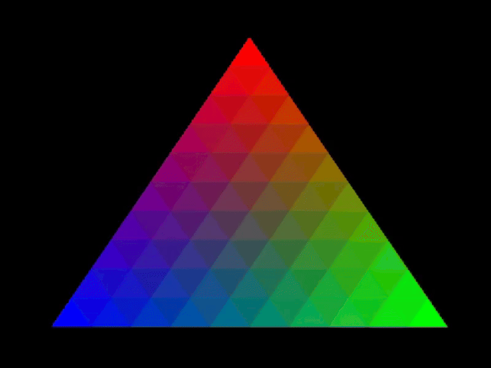

gpu-arena
=========

- `English (en) <#a-guided-tour-of-gpu-frameworks>`_
- `Français (fr) <#visite-guidée-de-cadres-logiciels-pour-processeurs-graphiques>`_

      front of a black background. The corners of the triangle are red, blue, and green, and the
      center of the triangle are colored in shades of these colors.

A Guided Tour of GPU Programming Frameworks
+++++++++++++++++++++++++++++++++++++++++++

Self-contained projects that show how to install a GPU programming framework, build
GPU-accelerated programs, and execute them. Refer to the ``readme`` file in each subdirectory for
more information.

**Note**: The projects are minimalist examples, not complete tutorials. The ``readme`` files in each
subdirectory provide references to more detailed resources.

Project Index
-------------

+------------------------------------------+----------------------------+-------------------------------------------+---------------+
| Framework                                | Applications               | Devices                                   | Operating     |
|                                          +----------+-----------------+-----+-------+-------+-----+---------------+ Systems       +
|                                          | Graphics | General-purpose | CPU |Nvidia | Intel | AMD | Apple Silicon |               |
+==========================================+==========+=================+=====+=======+=======+=====+===============+===============+
|`OpenGL <opengl/readme.md>`__             | Y        | Y               | N   | Y     | Y     | Y   | N             | Any           |
|                                          |          |                 |     |       |       |     |               | (deprecated   |
|                                          |          |                 |     |       |       |     |               | on Mac)       |
+------------------------------------------+----------+-----------------+-----+-------+-------+-----+---------------+---------------+
|`DirectX <directx/readme.md>`__           | Y        | Y               | N   | Y     | Y     | Y   | N             | Windows       |
+------------------------------------------+----------+-----------------+-----+-------+-------+-----+---------------+---------------+
|`Vulkan <vulkan/readme.md>`__             | Y        | Y*              | N   | Y     | Y     | Y   | N             | Any           |
|                                          |          |                 |     |       |       |     |               | (deprecated   |
|                                          |          |                 |     |       |       |     |               | on Mac)       |
+------------------------------------------+----------+-----------------+-----+-------+-------+-----+---------------+---------------+
|`Metal <metal/readme.md>`__               | Y*       | Y*              | N   | N     | N     | N   | Y             | Mac           |
|                                          |          |                 |     |       |       |     |               |               |
+------------------------------------------+----------+-----------------+-----+-------+-------+-----+---------------+---------------+
|`WebGPU <webgpu/readme.md>`__             | Y        | Y               | N   | Y     | Y     | Y   | Y             | Any           |
|                                          |          |                 |     |       |       |     |               |               |
+------------------------------------------+----------+-----------------+-----+-------+-------+-----+---------------+---------------+
|`CUDA <cuda/readme.md>`__                 | N        | Y               | N   | Y     | N     | N   | N             | Windows,      |
|                                          |          |                 |     |       |       |     |               | Linux         |
+------------------------------------------+----------+-----------------+-----+-------+-------+-----+---------------+---------------+
|`OpenCL <opencl/readme.md>`__             | N        | Y               | Y   | Y     | Y     | Y   | Y             | Any           |
|                                          |          |                 |     |       |       |     |               | (deprecated   |
|                                          |          |                 |     |       |       |     |               | on Mac)       |
+------------------------------------------+----------+-----------------+-----+-------+-------+-----+---------------+---------------+
|`SYCL <sycl/readme.md>`__                 | N        | Y*              | Y   | Y     | Y     | Y   | Y             | Any (CPU-only |
|                                          |          |                 |     |       |       |     |               | on Mac)       |
+------------------------------------------+----------+-----------------+-----+-------+-------+-----+---------------+---------------+
|`Triton <triton/readme.md>`__             | N        | Y*              | N   | Y     | N     | Y   | N             | Linux         |
|                                          |          |                 |     |       |       |     |               |               |
+------------------------------------------+----------+-----------------+-----+-------+-------+-----+---------------+---------------+
|`CPU <cpu/readme.md>`__                   | N        | Y               | Y   | N     | N     | N   | N             | Any           |
+------------------------------------------+----------+-----------------+-----+-------+-------+-----+---------------+---------------+

The sign ``*`` indicates that the corresponding example is not implemented in the project or is not
functional.

Performance Comparison
----------------------

The following table compares the performances of some backends to calculate the sum of elements in
an array through sum reduction. Keep in mind that results vary depending on the system and are
influenced by memory transfer overheads. This table is provided only as an indication.

+---------------------+-------------------------------------------+
| Framework           | Sum Reduction Time (s) for Array Sizes    |
|                     +----------+----------+----------+----------+
|                     | 256      | 1024     | 1e6      | 1e7      |
+=====================+==========+==========+==========+==========+
| C++ (1 CPU thread)  | 1e-06    | 1e-06    | 0.000191 | 0.001341 |
+---------------------+----------+----------+----------+----------+
| OpenGL              | 0.000605 | 0.000563 | 0.000582 | 0.000567 |
+---------------------+----------+----------+----------+----------+

Benchmarking
------------

Run the Python script ``benchmark.py`` to compare how performances vary depending on the number of
threads running on CPU:

.. code:: bash
   # Linux
   python3 benchmark.py

   # OS that begins with the letter W
   py benchmark.py

Visite guidée de cadres logiciels pour processeurs graphiques
+++++++++++++++++++++++++++++++++++++++++++++++++++++++++++++
